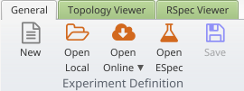
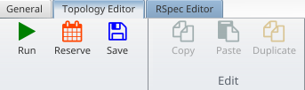
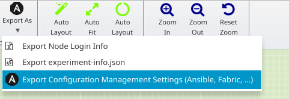

## Using an ESpec to test on the virtual wall (with jFed Experiment GUI)

Upsides:
- Real bare metal
- DNS, so working https

Downsides:
- Slow
- Multiple steps

Prerequisites:
- Install [cookiecutter](https://github.com/cookiecutter/cookiecutter#installation) (`apt install cookiecutter`)
- Install [jFed GUI](https://jfed.ilabt.imec.be/downloads/) (You need at least **jFed 6.4.7**!)
- Install [ansible](https://docs.ansible.com/ansible/latest/installation_guide/index.html)

(Step 0, 1, 2 are the same for jFed GUI and CLI2)

### Step 0: Configure RSpec generation parameters

Edit `rspec/cookiecutter.json` to customize some parameters. 
The most obvious one to change is `server_count`, to select the number of servers needed. 

Things to edit:
- `rspec_name`: The nickname of the generated RSpec. This will be used as a dir name, so best use only the chars `A-Za-z0-9_`.
- `server_count`: How many CSS servers do you want?
- `client_count`: How many machines do you want as clients? (leave as 0 if all you need are CSS servers)
- `component_manager_urn`: This selects which testbed is used. Each testbed has a "component manager URN" that identifies it.
- `disk_image_name`: If you change the testbed, you'll need to change the diskimage to an appropriate disk image.
- `server_hardware_type_name`: If not set to `"none"`, this is the name of the "hardware type" of the testbed to use for server nodes. 
- `client_hardware_type_name`: If not set to `"none"`, this is the name of the "hardware type" of the testbed to use for client nodes. 

### Step 1: Make the RSpec

Use cookiecutter to generate an RSpec with the number of nodes you need.

Execute this in the repository root dir:

```shell
cookiecutter --no-input --verbose --output-dir generated_rspec rspec
```

This will create a dir `generated_rspec/<rspec_name>/` containing the RSpec. (where `<rspec_name>` is the `rspec_name` set in step 1 in `rspec/cookiecutter.json`)

### Step 2: Configure ansible variables

Set the ansible variables in `ansible-variables.yaml`.

You can mostly leave these as is, but this variable is useful:
- `ss_use_https`: set to `true` for https (recommended), `false` for http.

### Step 3: Run the RSpec

Running the RSpec automates everything. This includes installing ansible on a node and running the playbook.

Start jFed.

Click on "Open Local":



Choose the `generated_rspec/<rspec_name>/` file, and click "Open", then click the green "Run" button:



Select a name for your experiment, and start it. Wait until it is running.

### Step 4: Get the ansible inventory

In jFed, export the ansible files.



Unzip the file you save. You'll typically only need the `ansible-hosts` file inside the zip file in the next step.

### Step 5: Run ansible

From the command line, run ansible to setup the software on the node:

```bash
cd <YOUR_SOLIDLAB_ENV_SETUP_LOCATION>  # Go to the dir with solidlab-env-setup
ansible-playbook --inventory=$(pwd)/generated_rspec/<YOUR_RSPEC_NAME>/ansible-hosts -v playbook.yaml
```

### Step 6 (optional): Extract css root URL list (JSON) 

On the ansible node (first CSS server in experiment) ansible will write files with URL info. You can thus gather all URLs with:

```shell
cat ~/ansible/css_url_* > all_urls
```

To get the same list from the jFed GUI, login to the `css0` node and run the command above.

### Step 7: Renew or Terminate Experiment

Inside jFed, you'll need to renew the experiment if you plan to use it for a longer time.

If you're done with the experiment, don't forget to terminate the experiment.
