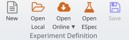
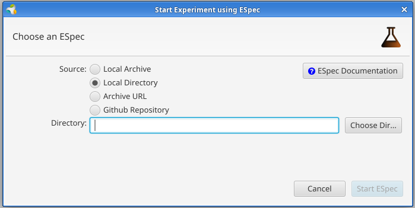

# SolidLab Env Setup

The tools in this repository allow you to set up multiple CSS servers easily.
These servers are ready for "css-populate": they accept new account registrations. 

## Using vagrant to test locally

Upsides:
- Quick
- Easy: all in one step

Downsides:
- No DNS name, so no https

Prerequisites: install ansible and vagrant

### Optional step 1: Configure number of servers in Vagrantfile

Just export the wanted numer of VMs as an env variable:

```shell
export SS_COUNT=2
```

Optionally, you can hardcode this in the `Vagrantfile`, so it doesn't depend on the environment.

### Optional step 2: Configure ansible

Set the ansible variables in `ansible-variables.yaml`.

You can mostly leave these as is, but this variable is useful:
- `ss_use_https`: set to `false` for http (recommended with vagrant), `true` for https (doesn't work with vagrant).

### step 3: Start the VMs

```shell
ansible-galaxy install -r ansible-galaxy-requirements.yaml
vagrant up
#vagrant provision
vagrant ssh
```

### Optional step 4: Get css root URL list

Ansible will write files with URL info in the last playbook step. You can thus gather all URLs with:

```shell
cat css_url_* > all_urls
```


You can also just create a (the predictable) list of CSS server root URLs with something like:

```shell
for i in $(seq 0 $(( SS_COUNT - 1 )) )
do
  echo "http://localhost:$(( $i + 3000 ))/"
done
```

## Using an ESpec to test on the virtual wall (with jFed Experiment GUI)

Upsides:
- Real bare metal
- DNS, so working https

Downsides:
- Slow
- Multiple steps

Prerequisites: Install cookiecutter and jFed

### Step 0: Configure ESpec generation parameters

Edit `espec/cookiecutter.json` to customize some parameters. 
The most obvious one to change is `server_count`, to select the number of servers needed. 

Things to edit:
- `espec_name`: The nickname of the generated espec. This will be used as a dir name, so best use only the chars `A-Za-z0-9_`.
- `server_count`: How many CSS servers do you want?
- `client_count`: How many machines do you want as clients? (leave as 0 if all you need are CSS servers)
- `component_manager_urn`: This selects which testbed is used. Each testbed has a "component manager URN" that identifies it.
- `disk_image_name`: If you change the testbed, you'll need to change the diskimage to an appropriate disk image.
- `server_hardware_type_name`: If not set to `"none"`, this is the name of the "hardware type" of the testbed to use for server nodes. 
- `client_hardware_type_name`: If not set to `"none"`, this is the name of the "hardware type" of the testbed to use for client nodes. 

### Step 1: Make the ESpec

Use cookiecutter to generate an ESpec with the number of nodes you need.

Execute this in the repository root dir:

```shell
cookiecutter --no-input --verbose --output-dir generated_espec espec
```

This will create a dir `generated_espec/<espec_name>/` containing the ESpec. (where `<espec_name>` is the `espec_name` set in step 1 in `espec/cookiecutter.json`)

### Step 2: Configure ansible variables

Set the ansible variables in `ansible-variables.yaml`.

You can mostly leave these as is, but this variable is useful:
- `ss_use_https`: set to `true` for https (recommended), `false` for http.

### Step 3: Run the ESpec

Start jFed.

Click on "Open ESpec":



Select "Local Directory", and click "Choose Dir".
Choose the `generated_espec/<espec_name>/` directory, and click "Start ESpec":



Select a name for your experiment, and start it. Now wait until it is running, and the ESpec and ansible script have successfully completed.

### Step 3 (alt): Use RSpec and manually start ansible

Instead of using the ESpec to start ansible, you can just start the experiment and run ansible manually.

Start jFed.

Click on "Open RSpec". Open the rspec in the `generated_espec/<espec_name>/`. Start the experiment.

When the experiment is running, click "Export As", then choose "Export configuration management settings (Ansible, Fabric, ...)".
Save the zip, and extract it somewhere.

Run ansible from this repo's root dir, like this:

```shell
ansible-galaxy install -r ansible-galaxy-requirements.yaml
ansible-playbook --inventory <dir of extracted zip>/ansible-hosts --ssh-common-args '-A -o ControlMaster=auto -o ControlPersist=1200' playbook.yaml
```


### Step 4 (optional): Extract css root URL list (JSON) 

On the ansible node (first CSS server in experiment) ansible will write files with URL info. You can thus gather all URLs with:

```shell
cat ~/ansible/css_url_* > all_urls
```

To get the same list from the jFed GUI, login to the `css0` node and run the command above.

### Step 5: Renew or Terminate Experiment

Inside jFed, you'll need to renew the experiment if you plan to use it for a longer time.

If you're done with the experiment, don't forget to terminate the experiment.

## Using an ESpec to test on the virtual wall (with jFed CLI2)

Upsides:
- Real bare metal
- DNS, so working https

Downsides:
- Slow
- Slightly more complex setup

Prerequisites: Install cookiecutter and jFed CLI2

### Step 0, 1, 2

Same as for jFed GUI.

### Step 3: Run the ESpec

Edit `jfed-cli2-run-espec.yaml`. You'll need to replace the following:
- `<<GENERATED_DIR>>`: The absolute path of the generated dir with `jfed-cli2-run-espec.yaml` and `experiment-specification.yaml` in it.
- `<<YOUR_PORTAL_PROJECT>>`: The project you want to create an experiment in
- `<<YOUR_WANTED_EXPERIMENT_NAME>>`: A name for your new experiment
- `<<YOUR_LOGIN_PEM>>`: The login file for your portal account. You can download this at the bottom of the homepage of the account portal.

Execute this file with jFed CLI2:
```shell
COMMAND_FILE="$(readlink -f jfed-cli2-run-espec.yaml)" 
cd <jfed_cli_utils_dir>
java -jar experimenter-cli2.jar -a "${COMMAND_FILE}"
```

Now wait until the experiment is running, and the ESpec and ansible script have successfully completed.

### Step 4 (optional): Extract css root URL list (JSON) 

#### Option 1: manual `scp`

To get the same list when using the jFed CLI to execute the ESpec, 
you'll notice that the jFed CLI writes a file `ssh_info.csv` when running the CLI (this is requested in the ESpec).

You can download the URL files and then use `cat` as before to summarize them:
```shell
cd <jfed_cli_utils_dir>
ls ssh_info.csv
scp "$(grep -e '^css0,' ssh_info.csv | cut -d, -f6):~/ansible/css_url_*" .
cat css_url_* | tee all_urls
```

#### Option2: jFed CLI2 fetch

Alternatively, you can use jFed CLI2 to get a file with all URLs.

Edit `jfed-cli2-fetch-urls.yaml`. You'll again need to replace the following:
- `<<GENERATED_DIR>>`: The absolute path of the generated dir with `jfed-cli2-run-espec.yaml` and `experiment-specification.yaml` in it. Or another dir in which you want the output file `ss_url` to be written.
- `<<YOUR_PORTAL_PROJECT>>`: The project you created the experiment in
- `<<YOUR_EXPERIMENT_NAME>>`: The name of the now running experiment
- `<<YOUR_LOGIN_PEM>>`: The login file for your portal account.

Execute this file with jFed CLI2:
```shell
COMMAND_FILE="$(readlink -f jfed-cli2-fetch-urls.yaml)" 
cd <jfed_cli_utils_dir>
java -jar experimenter-cli2.jar -a "${COMMAND_FILE}"
```

You'll now find a file `ss_url` in the dir with `jfed-cli2-fetch-urls.yaml`, which contains all CSS server URLs.

### Step 5: Renew or Terminate Experiment

Inside jFed, you'll need to renew the experiment if you plan to use it for a longer time.

If you're done with the experiment, don't forget to terminate the experiment.

